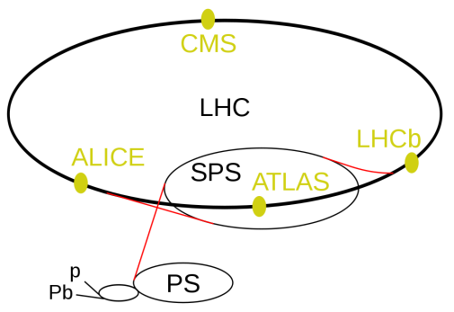

## Electron-electron beams
 * Colliders with electron-electron beams have low energies but have clear good quality data compared to pp colliders
 * Electron-electron beams cannot have high energy because of synchrotron radiation. As the high velocity electrons move thorugh magnetic fields they emit electromagnetic energy which reduces their energy. So the electrons lose all of their energy. This is only true for circular accelerators. Linear accelerators do not suffer from this problem. Electron beams give good clear data and signals because electrons are fundamental particles with no substructure. In an interaction between electrons there is very little background noise.
 * Example: http://home.web.cern.ch/about/accelerators/large-electron-positron-collider

## Circular colliders
 * These accelerators are compact compared to some high energy linear accelerators as the same magnets and electric fields can be used because the beam travels in a circle.
 * These accelerators use magnets to constrain a beam of particles in a circle or spiral, and electric fields to accelrate them. 
 * Cyclotron
    + A cheap and compact acceletrator of charged particles with relatively high luminosity. However, it can't acceletrate particles to a very high energy because it doesn't adjust for relativistic effects.
    + A cyclotron is an early form of particle accelerator which produces charged particles at the center of a circle and uses rapidly varying RF electric fields to accelerate the particles. It uses a static magnetic field to keep the particles in a spiral trajectory away from the center of the circle. It can then fire the beam out in a stright line to use in experiments. See http://en.wikipedia.org/wiki/Cyclotron#Principle_of_operation
    
    + http://en.wikipedia.org/wiki/File:Cyclotron_patent.png
 * Radius
    + The radius of the circular collider determines the energy of the particles. The particles move in a circle due to magnetic fields. The radius of curvature depends on the energy of the particles and the strength of the magnetic field. See http://www.egglescliffe.org.uk/physics/particles/newfolder/acc1.html
    
